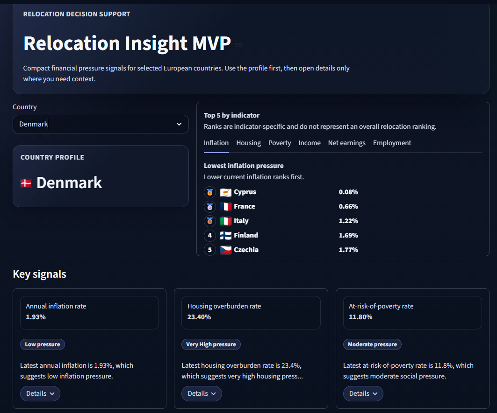
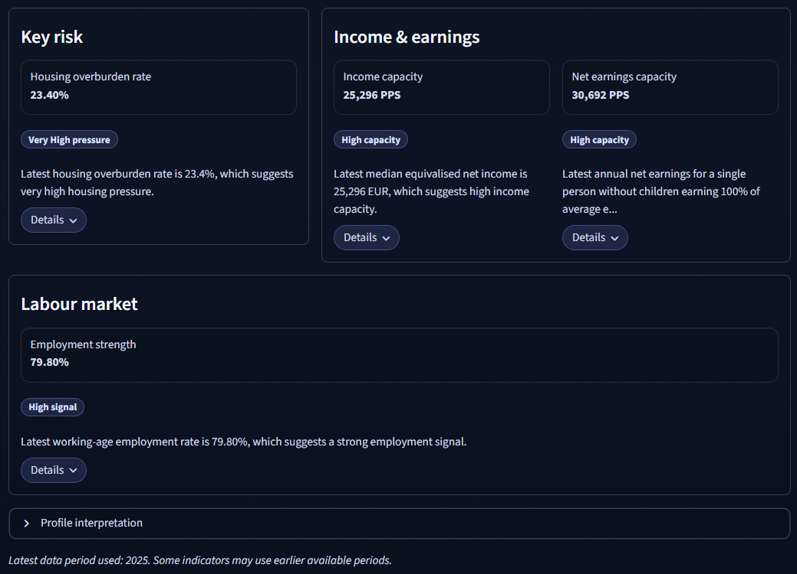
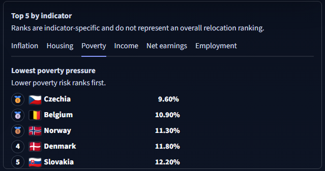
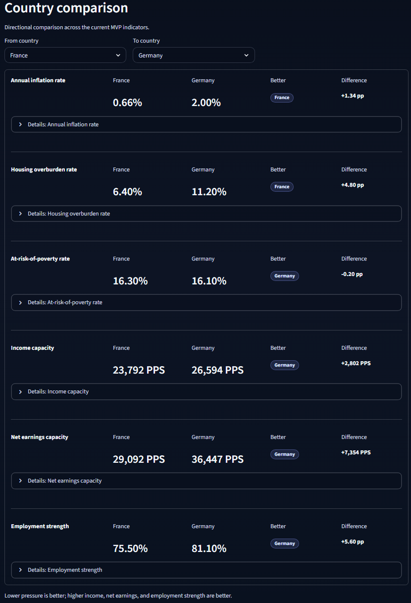
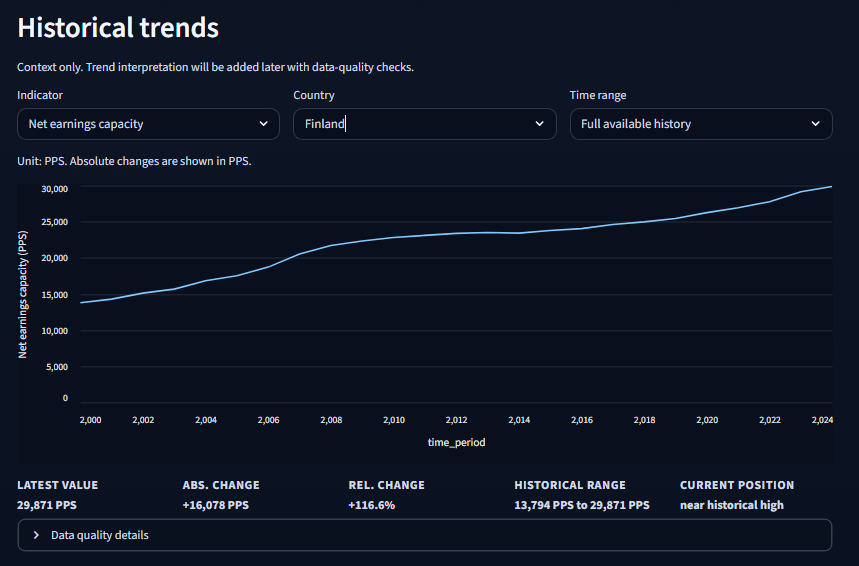
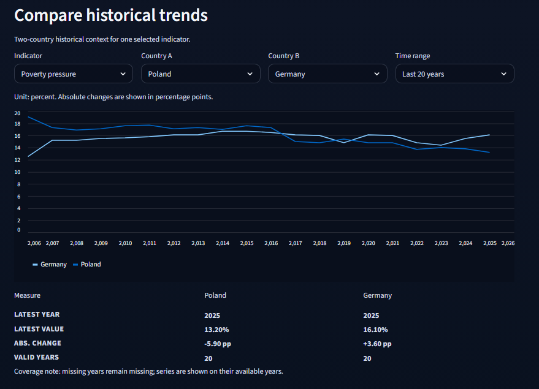
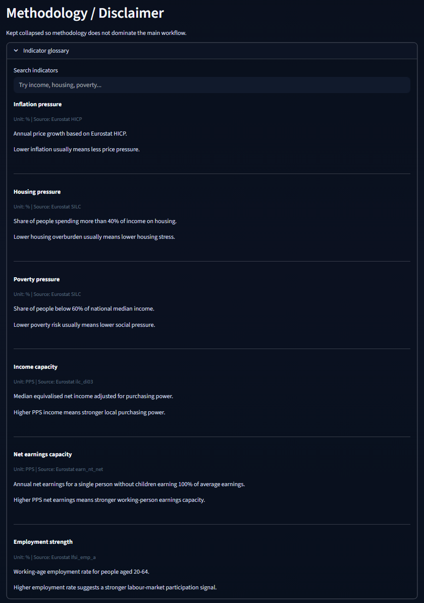

# Relocation Insight MVP

Early-stage exploration tool for comparing European countries by financial, social, income, and labour-market indicators using Eurostat data.

**This is not a relocation recommendation engine.** It provides structured context for research only.

## What This MVP Does

Compares 28 European countries across six current indicators:

1. **Inflation pressure** - annual inflation rate from Eurostat HICP
2. **Housing pressure** - housing overburden rate, or the share of people spending more than 40% of income on housing
3. **Poverty pressure** - at-risk-of-poverty rate, or the share of people below 60% of national median income
4. **Income capacity** - median equivalised net income in PPS from Eurostat `ilc_di03`
5. **Net earnings capacity** - annual net earnings in PPS from Eurostat `earn_nt_net` for a single person, no children, earning 100% of average earnings
6. **Employment strength** - working-age employment rate from Eurostat `lfsi_emp_a`

The three pressure indicators are lower-is-better. `income_capacity`, `net_earnings_capacity`, and `employment_strength` are higher-is-better and are not pressure indicators.

## Current App Features

- Modernized Streamlit UI with a compact, readable layout
- Country selector with selected-country profile display and real flag images
- Key signals, key risk driver, income and earnings capacity, employment signal, and detailed indicator cards
- Compact **Top 5 by indicator** section with real flag images and medals for the top 3
- Current-value country comparison, redesigned to use less vertical space
- Historical trends with time ranges:
  - Last 10 years
  - Last 20 years
  - Full available history
- Historical outlier context notes
- Cross-country historical trend comparison
- Searchable indicator glossary
- Methodology notes, MVP disclaimer, and CSV export for the selected country profile

Historical charts are factual/contextual only. The app does not use forecast, prediction, or strong trend-interpretation language.

## App Preview

### App Overview

*App overview.*

### Country Profile

*Country profile and key signals.*

### Top 5 by Indicator

*Top 5 by indicator.*

### Country Comparison

*Country comparison.*

### Historical Trends

*Historical trends.*

### Trend Comparison

*Cross-country historical trend comparison.*

### Indicator Glossary

*Indicator glossary / methodology.*

## Quick Start

Create and activate the virtual environment:

```powershell
python -m venv .venv
.venv\Scripts\Activate
pip install -r requirements.txt
```

Generate data:

```powershell
python data_pipeline/run_mvp_pipeline.py
```

Run the app:

```powershell
streamlit run frontend/streamlit_app.py
```

## Deployment

This app can be deployed on Streamlit Community Cloud.

- App entry point: `frontend/streamlit_app.py`
- Python dependencies: `requirements.txt`
- Optional theme config: `.streamlit/config.toml`
- Runtime data: committed CSV files in `data/clean/`, especially `all_mvp_insights.csv` and `all_mvp_timeseries.csv`

Before deploying refreshed data, run the pipeline locally and commit the updated `data/clean/` CSV files.

## Country Coverage

Austria, Belgium, Bulgaria, Croatia, Cyprus, Czechia, Denmark, Estonia, Finland, France, Germany, Greece, Hungary, Ireland, Italy, Latvia, Lithuania, Luxembourg, Malta, Netherlands, Norway, Poland, Portugal, Romania, Slovakia, Slovenia, Spain, Sweden.

Important Eurostat codes:

- Greece uses code `EL`, not `GR`.
- Norway code `"NO"` must be quoted in YAML configuration because unquoted `NO` can parse as Boolean.

## Data Outputs

Key clean outputs in `data/clean/` include:

- `hicp_annual_inflation_mvp_countries.csv`
- `housing_overburden_mvp_countries.csv`
- `poverty_risk_mvp_countries.csv`
- `income_capacity_mvp_countries.csv`
- `net_earnings_capacity_mvp_countries.csv`
- `net_earnings_capacity_insights.csv`
- `employment_strength_mvp_countries.csv`
- `employment_strength_insights.csv`
- `all_mvp_insights.csv` - powers current insights and profile cards
- `all_mvp_timeseries.csv` - powers historical trend charts

## What Is Not Included

This MVP does not include full salary modeling, detailed tax/benefit simulation, detailed job-market or vacancy data, healthcare, language, culture, lifestyle fit, city-level data, personal preferences, immigration policies, or a final relocation recommendation engine.

`net_earnings_capacity` is scenario-based. It represents one selected worker profile and should be interpreted as a directional working-person earnings signal, not as a complete view of all households, professions, or personal situations.

## Technical Stack

- Python 3.x
- Eurostat REST API
- pandas
- Streamlit
- PyYAML
- CSV outputs

## For Developers

See `docs/pipeline_workflow.md` for technical pipeline details.  
See `docs/project_handoff.md` for current project handoff notes.
